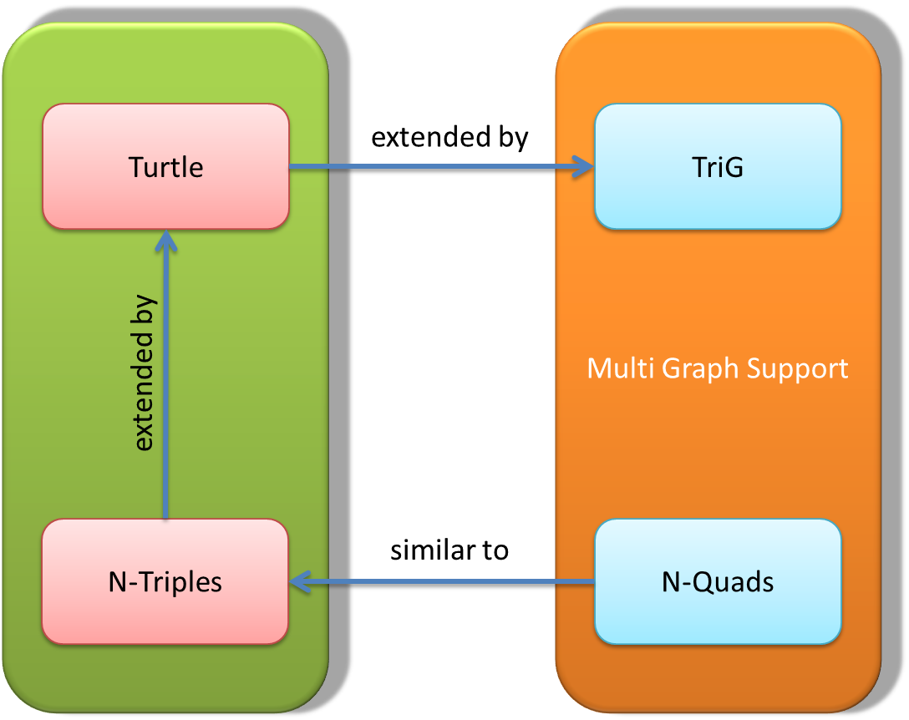

&nbsp;&nbsp;&nbsp;**Cheló̱na**  

A Parboiled2 based Scala Parser for the W3C RDF 1.1 Turtle, TriG, N-Triple and N-Quad Languages

Introduction
============

*Cheló̱na* (χελώνα) is the greek word for turtle. At the time working on this software I spent a beautiful holiday on the island of Rhodos, so this seemed to be an appropriate name for a turtle parser.

With *Cheló̱na* you can
 
- validate the syntax and semantic of a W3C RDF 1.1 *TriG*, *Turtle*, *N-Quads* or *N-Triples* file
- convert a *TriG* or *N-Quads* file into its canonical quad format
- convert a *Turtle* or *N-Triples* file into its canonical triple format

*Cheló̱na* supports the creation of your own output format. 
*Cheló̱na* leaves it up to you to write the conversion result e.g. to a file, to a database or communicate via actors. 

The relationship among the various RDF 1.1 formats is shown in this image

*Cheló̱na* successfully masters the complete TriG-, Turtle- and N-Triples test suites described at http://www.w3.org/TR/rdf11-testcases/.
The 100% compliance of the Turtle test suite is listed at https://dvcs.w3.org/hg/rdf/raw-file/default/rdf-turtle/reports/index.html#subj_10 .
The compliance of the TriG- and N-Triples test suite is reported to the W3C gremium.

*Cheló̱na* is written completely in Scala. Parsing of the supported RDF 1.1 formats is done with the help of [Parboiled2](https://github.com/sirthias/parboiled2 "Parboiled2").

Turtle Section
==============

First Example
=============

A simple turtle file taken from the W3C recommendation which resides at http://www.w3.org/TR/turtle/ :

    @prefix foaf: <http://xmlns.com/foaf/0.1/> .

    _:alice foaf:knows _:bob .
    _:bob foaf:knows _:alice .

*Cheló̱na* dissolves the statements into the canonical form, which is represented by pure subject, predicate and object components:

    _:alice <http://xmlns.com/foaf/0.1/knows> _:bob .
    _:bob <http://xmlns.com/foaf/0.1/knows> _:alice .
	
Second Example
==============

The next turtle file is listed as example 15 in the W3C RDF 1.1 Turtle Definition document at http://www.w3.org/TR/turtle :

    @prefix foaf: <http://xmlns.com/foaf/0.1/> .

    # Someone knows someone else, who has the name "Bob".
    [] foaf:knows [ foaf:name "Bob" ] .

*Cheló̱na* transforms the statements into the simple subject-predicate-object (s-p-o) format:

    _:a1 <http://xmlns.com/foaf/0.1/knows> _:b1 .
    _:b1 <http://xmlns.com/foaf/0.1/name> "Bob" .
	
Third Example
============

This is example 23 from the W3C RDF 1.1 Terse RDF Triple Language definition

	@prefix : <http://example.org/stuff/1.0/> .
	(1 2.0 3E1) :p "w" .
	
*Cheló̱na* resolves the collection and gives the equivalent sequence of turtle statements in the canonical form:

    _:c1 <http://www.w3.org/1999/02/22-rdf-syntax-ns#first> "1"^^<http://www.w3.org/2001/XMLSchema#integer> .
    _:c1 <http://www.w3.org/1999/02/22-rdf-syntax-ns#rest> _:c2 .
    _:c2 <http://www.w3.org/1999/02/22-rdf-syntax-ns#first> "2.0"^^<http://www.w3.org/2001/XMLSchema#decimal> .
    _:c2 <http://www.w3.org/1999/02/22-rdf-syntax-ns#rest> _:c3 .
    _:c3 <http://www.w3.org/1999/02/22-rdf-syntax-ns#first> "3E1"^^<http://www.w3.org/2001/XMLSchema#double> .
    _:c3 <http://www.w3.org/1999/02/22-rdf-syntax-ns#rest> <http://www.w3.org/1999/02/22-rdf-syntax-ns#nil> .
    _:c1 <http://example.org/stuff/1.0/p> "w" .

Installation
============
	
Create a *Cheló̱na* JAR with all dependencies
--------------------------------------------

The *sbt-assembly* plugin located at https://github.com/sbt/sbt-assembly is used to create a *Cheló̱na* JAR containing all dependencies.
Move into the *Cheló̱na* directory.
From the command line type 

    sbt assembly
	
This should generate an archive

    target/scala-2.11/chelona-assembly-x.x.x.jar

where x.x.x denotes the version information, e.g. chelona-assembly-1.0.0.jar.

Running *Cheló̱na* from the command line
----------------------------------------

Conversion of the example1.ttl file from the examples directory into the simple S-P-O Turtle format (N3)

	<#green-goblin> rel:enemyOf    <#spiderman> 	;
	    a foaf:Person ;    # in the context of the Marvel universe
	    foaf:name "Green Goblin" ;
		foaf:mail "GreenGoblin@marvel.com" .

	<#spiderman>
	    rel:enemyOf <#green-goblin> ;
	    a foaf:Person ;
	    foaf:name "Spiderman", "Человек-паук"@ru .

is done with the command shown here: 

    scala -cp ./target/scala-2.11/chelona-assembly-1.0.0.jar org.chelona.Main --verbose ./examples/example1.ttl > example1_n3.ttl

The output generated lists the name of the output file and the number of generated triples:

	Convert: ./examples/example1.ttl
    Input file './examples/example1.ttl' converted in 0.064sec 8 triples (triples per second = 125)
	
Inspecting the output file 'example1_n3.ttl' should give this result:

	<http://example.org/#green-goblin> <http://www.perceive.net/schemas/relationship/enemyOf> <http://example.org/#spiderman> .
    <http://example.org/#green-goblin> <http://www.w3.org/1999/02/22-rdf-syntax-ns#type> <http://xmlns.com/foaf/0.1/Person> .
    <http://example.org/#green-goblin> <http://xmlns.com/foaf/0.1/name> "Green Goblin" .
    <http://example.org/#green-goblin> <http://xmlns.com/foaf/0.1/mail> "GreenGoblin@marvel.com" .
    <http://example.org/#spiderman> <http://www.perceive.net/schemas/relationship/enemyOf> <http://example.org/#green-goblin> .
    <http://example.org/#spiderman> <http://www.w3.org/1999/02/22-rdf-syntax-ns#type> <http://xmlns.com/foaf/0.1/Person> .
    <http://example.org/#spiderman> <http://xmlns.com/foaf/0.1/name> "Spiderman" .
    <http://example.org/#spiderman> <http://xmlns.com/foaf/0.1/name> "Человек-паук"@ru .

Validation of a Turtle File
---------------------------

When passing the parameter '--validate' on the command line, *Cheló̱na* will do a syntax check. No output file is generated.

    scala -cp ./target/scala-2.11/chelona-assembly-1.0.0.jar org.chelona.Main --validate --verbose examples/example1.ttl

	Validate: examples/example1.ttl
    Input file 'examples/example1.ttl' composed of 7 statements successfully validated in 0.099sec (statements per second = 71)

Unique Blank Node Names
-----------------------

For sake of convenience the next examples assume that an alias chelona has been created.

    alias chelona="scala -cp ./target/scala-2.11/chelona-assembly-1.0.0.jar org.chelona.Main"

The '--uid' command line argument instructs *Cheló̱na* to use a unique identifier for blank nodes.

    chelona --uid examples/example23.ttl

    _:c83cecd897cf243a9a6203bad3f5f0b411 <http://www.w3.org/1999/02/22-rdf-syntax-ns#first> "1"^^<http://www.w3.org/2001/XMLSchema#integer> .
    _:c83cecd897cf243a9a6203bad3f5f0b411 <http://www.w3.org/1999/02/22-rdf-syntax-ns#rest> _:c83cecd897cf243a9a6203bad3f5f0b412 .
    _:c83cecd897cf243a9a6203bad3f5f0b412 <http://www.w3.org/1999/02/22-rdf-syntax-ns#first> "2.0"^^<http://www.w3.org/2001/XMLSchema#decimal> .
    _:c83cecd897cf243a9a6203bad3f5f0b412 <http://www.w3.org/1999/02/22-rdf-syntax-ns#rest> _:c83cecd897cf243a9a6203bad3f5f0b413 .
    _:c83cecd897cf243a9a6203bad3f5f0b413 <http://www.w3.org/1999/02/22-rdf-syntax-ns#first> "3E1"^^<http://www.w3.org/2001/XMLSchema#double> .
    _:c83cecd897cf243a9a6203bad3f5f0b413 <http://www.w3.org/1999/02/22-rdf-syntax-ns#rest> <http://www.w3.org/1999/02/22-rdf-syntax-ns#nil> .
    _:c83cecd897cf243a9a6203bad3f5f0b411 <http://example.org/stuff/1.0/p> "w" .

Base Definition
---------------

Relative IRIs like <#green-goblin> are resolved relative to the current base IRI. When no base is defined, the value passed by the
'--base' parameter is prepended to the relative IRI.
File 'base.ttl' consist of the single triple statement with two relative IRIs.

    <#green-goblin> a <#comic-hero> .

The relative IRIs are appended to the "http://marvel/universe" string.

    chelona --base "http://marvel/universe" base.ttl

    <http://marvel/universe/#green-goblin> <http://www.w3.org/1999/02/22-rdf-syntax-ns#type> <http://marvel/universe/#comic-hero> .

With $PWD resolving to "/Users/jp/chelona" the '--base' parameter produces a prefix "<file:///Users/jp/chelona/" which is prepended to the relative IRI.

    chelona --base "file://"$PWD base.ttl

    <file:///Users/jp/chelona/#green-goblin> <http://www.w3.org/1999/02/22-rdf-syntax-ns#type> <file:///Users/jp/chelona/#comic-hero> .

Error Handling
--------------

In case of an error *Cheló̱na* will display an error message and give a hint where the problem occurred.

    chelona --validate --verbose TurtleTests/turtle-syntax-bad-struct-02.ttl

    Validate: TurtleTests/turtle-syntax-bad-struct-02.ttl
    File 'TurtleTests/turtle-syntax-bad-struct-02.ttl': Invalid input '=', expected predicate or http://www.w3.org/1999/02/22-rdf-syntax-ns#type (line 2, column 40):
    <http://www.w3.org/2013/TurtleTests/s> = <http://www.w3.org/2013/TurtleTests/o> .

Some internal parsing information will be emitted in case of an error when "--trace" is used as command line argument.

    chelona --validate --verbose --trace TurtleTests/turtle-syntax-bad-struct-02.ttl

    Validate: TurtleTests/turtle-syntax-bad-struct-02.ttl
    File 'TurtleTests/turtle-syntax-bad-struct-02.ttl': Invalid input '=', expected IRIREF or prefixedName (line 2, column 40):
    <http://www.w3.org/2013/TurtleTests/s> = <http://www.w3.org/2013/TurtleTests/o> .
                                           ^

    5 rules mismatched at error location:
      ...oc/ *:-58 /statement/ |:-39 /triples/ |:-39 /predicateObjectList/ + /po/ /verb/ | /predicate/ /iri/ | /IRIREF/ atomic / '<'
      ...| /predicate/ /iri/ | /prefixedName/ | /PNAME_LN/ /PNAME_NS/ ? /PN_PREFIX/ atomic / capture / PN_CHARS_BASE:<CharPredicate>
      ... |:-39 /triples/ |:-39 /predicateObjectList/ + /po/ /verb/ | /predicate/ /iri/ | /prefixedName/ | /PNAME_LN/ /PNAME_NS/ ':'
      ...po/ /verb/ | /predicate/ /iri/ | /prefixedName/ | /PNAME_NS/ ? /PN_PREFIX/ atomic / capture / PN_CHARS_BASE:<CharPredicate>
      .../statement/ |:-39 /triples/ |:-39 /predicateObjectList/ + /po/ /verb/ | /predicate/ /iri/ | /prefixedName/ | /PNAME_NS/ ':'

Programmatical Interface
========================

The example program shows how to convert some Turtle data into the N3 Triple format.

    import java.io.StringWriter

    import org.chelona.{ RDFTripleOutput, ChelonaParser }

    import org.parboiled2.ParseError

    import scala.util.{ Failure, Success }

    object Main extends App with RDFTripleOutput {

      val input =
        """@base <http://example.org/> .
           @prefix rdf: <http://www.w3.org/1999/02/22-rdf-syntax-ns#> .
           @prefix rdfs: <http://www.w3.org/2000/01/rdf-schema#> .
           @prefix foaf: <http://xmlns.com/foaf/0.1/> .
           @prefix rel: <http://www.perceive.net/schemas/relationship/> .

           <#green-goblin> rel:enemyOf    <#spiderman> 	;
              a foaf:Person ;    # in the context of the Marvel universe
              foaf:name 'Green Goblin' ;
              foaf:mail 'GreenGoblin@marvel.com' .

           <#spiderman>
              rel:enemyOf <#green-goblin> ;
              a foaf:Person ;
              foaf:name 'Spiderman', 'Человек-паук'@ru ."""

      val output = new StringWriter()

      val parser = ChelonaParser(input,  tripleWriter(output)_)

      parser.turtleDoc.run() match {
        case Success(tripleCount) ⇒
          System.err.println("Input converted to " + tripleCount + " triples.")
          println(output)
        case Failure(e: ParseError) ⇒ System.err.println("Unexpected error during parsing run: " + parser.formatError(e))
        case Failure(e)             ⇒ System.err.println("Unexpected error during parsing run: " + e)
      }
    }

Build Your Own Output Format
============================

Look at https://github.com/JuPfu/chelona/wiki to see how to create your own output format.

What *Cheló̱na* Does in Detail:
==============================
- parses the ttl file
- reports syntax errors
- builds an abstract syntax tree for each valid turtle statement
- resolves prefix declarations
- unescapes numeric and string escape sequences in string-literal productions
- unescapes numeric escape sequences in Iriref productions for output format 'raw'
- transforms each turtle statment into the canonical subject-predicate-object (s-p-o) format
- skolemisation (Replacing blank nodes with IRIs) (to be done)

TriG-Section
============

The TriG language definition can be found here http://www.w3.org/TR/trig/ .

First Example
=============

Example1 at https://www.w3.org/TR/trig/ is a simple TriG-file, which is part of the language description at http://www.w3.org/TR/trig/ .

    # This document encodes one graph.
    @prefix ex: <http://www.example.org/vocabulary#> .
    @prefix : <http://www.example.org/exampleDocument#> .
    
    :G1 { :Monica a ex:Person ;
                  ex:name "Monica Murphy" ;
                  ex:homepage <http://www.monicamurphy.org> ;
                  ex:email <mailto:monica@monicamurphy.org> ;
                  ex:hasSkill ex:Management ,
                              ex:Programming . }

*Cheló̱na* dissolves the statements into the canonical quad form, which is represented by pure subject, predicate, object and graph components:

    <http://www.example.org/exampleDocument#Monica> <http://www.w3.org/1999/02/22-rdf-syntax-ns#type> <http://www.example.org/vocabulary#Person> <http://www.example.org/exampleDocument#G1> .
    <http://www.example.org/exampleDocument#Monica> <http://www.example.org/vocabulary#name> "Monica Murphy" <http://www.example.org/exampleDocument#G1> .
    <http://www.example.org/exampleDocument#Monica> <http://www.example.org/vocabulary#homepage> <http://www.monicamurphy.org> <http://www.example.org/exampleDocument#G1> .
    <http://www.example.org/exampleDocument#Monica> <http://www.example.org/vocabulary#email> <mailto:monica@monicamurphy.org> <http://www.example.org/exampleDocument#G1> .
    <http://www.example.org/exampleDocument#Monica> <http://www.example.org/vocabulary#hasSkill> <http://www.example.org/vocabulary#Management> <http://www.example.org/exampleDocument#G1> .
    <http://www.example.org/exampleDocument#Monica> <http://www.example.org/vocabulary#hasSkill> <http://www.example.org/vocabulary#Programming> <http://www.example.org/exampleDocument#G1> .
	
Conversion is done with

    scala -cp ./target/scala-2.11/chelona-assembly-1.0.0.jar org.chelona.TriGMain --verbose ./examples/example1.trig > example1.nq
    
Recommended definitions
=======================

For ease of use copy the generated Chelona-assembly-X.X.X.jar to /usr/local/lib/. Define an alias for each of the RDF-formats: 

    alias chelona_turtle='scala -Yopt:_ -J-Xmx2G -cp /usr/local/lib/scala-2.11/Chelona-assembly-1.0.0.jar org.chelona.Main'
    alias chelona_trig='scala -Yopt:_ -J-Xmx2G -cp /usr/local/lib/scala-2.11/Chelona-assembly-1.0.0.jar org.chelona.TriGMain'
    alias chelona_nt='scala -Yopt:_ -J-Xmx2G -cp /usr/local/lib/scala-2.11/Chelona-assembly-1.0.0.jar org.chelona.NTMain'
    alias chelona_nquad='scala -Yopt:_ -J-Xmx2G -cp /usr/local/lib/scala-2.11/Chelona-assembly-1.0.0.jar org.chelona.NQuadMain'
    
For huge input data it might be necessary to increase the heap-size.

Postscript
==========
Questions, support, cooperation or collaboration are explicitely welcome!

License
=======

*Cheló̱na* is released under the `Apache License 2.0`

http://en.wikipedia.org/wiki/Apache_license

